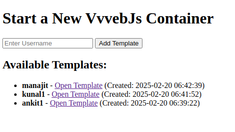
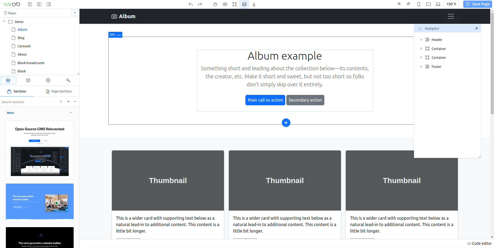

### Intro
This website helps users build other drag and drop / less code websites .


### requirements
- docker
- nodejs
- unbuntu or similar os
- sqlite (no need to setup anything)

### Usage
```
npm i   
nodemon --ignore websites/
```
open http://localhost:3000/ in browser



Then click on any template to view/edit template



docker exec -it vvvebjs_username sh

This path /var/www/vvveb/public/demo/landing has the landing page files         

Create demo/landing/manajit.html
cp -Rp offcanvas/ manajit/
cd manajit/

Copy your assets to location as per the path demo/landing/manajit.html  

In /var/www/vvveb/public/editor.html  just before the line "let pages = defaultPages;" , add below code
```
defaultPages = {
    "manajit": {
        name: "manajit",
        filename: "manajit.html",
        file: "demo/landing/manajit.html",
        url: "demo/landing/manajit.html",
        title: "manajit page",
        folder: null,
        description: "Website homepage"
    },
};	
```
### Database schema 
```
CREATE TABLE templates (
    id INTEGER PRIMARY KEY AUTOINCREMENT,
    username TEXT NOT NULL,
    container_name TEXT NOT NULL,
    port INTEGER NOT NULL,
    template_path TEXT NOT NULL,
    created_at DATETIME DEFAULT CURRENT_TIMESTAMP
);
```